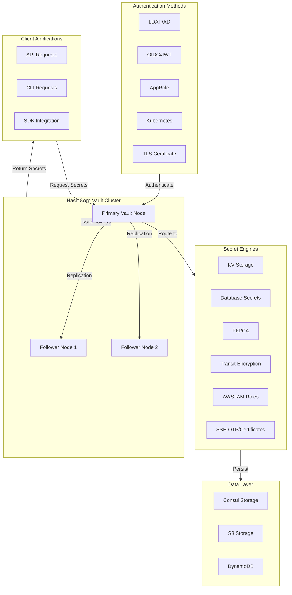
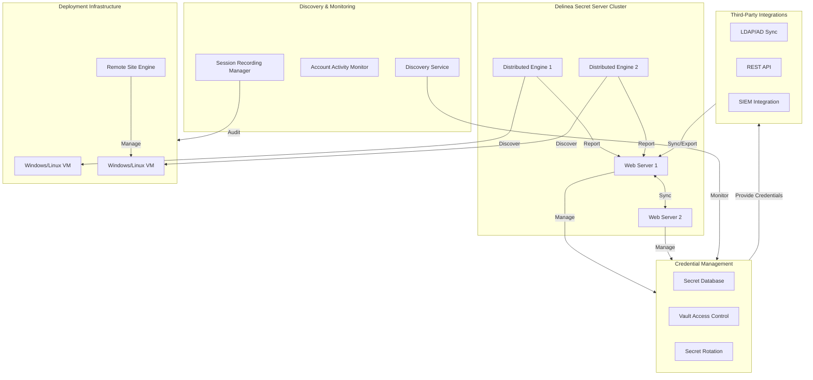
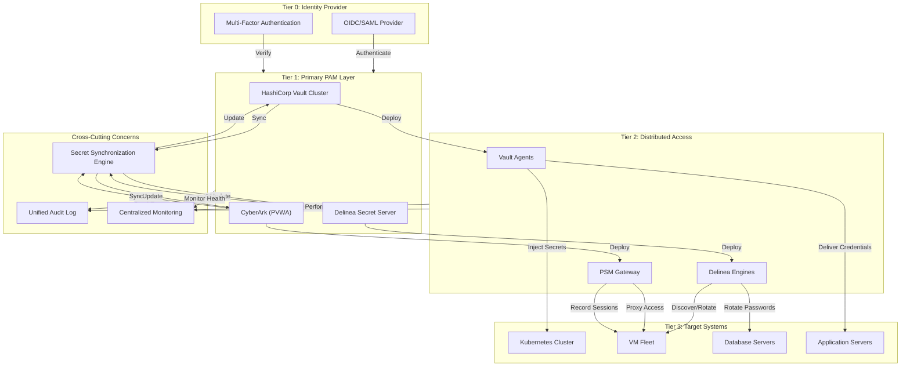
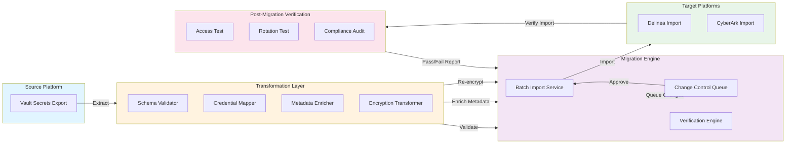

# PAM Architecture: Multi-Vendor Implementation Guide

**Author:** Dominic M. Hoang
**Last Updated:** January 19, 2026
**Version:** 1.0

---

## Executive Summary

This document provides a comprehensive architectural overview of multi-vendor Privileged Access Management (PAM) implementations, comparing HashiCorp Vault, Delinea Secret Server, and CyberArk. Organizations often require a hybrid approach using multiple PAM solutions to meet diverse security, compliance, and operational requirements.

### Key Strategic Considerations

* **HashiCorp Vault** excels in infrastructure-as-code environments, dynamic secrets generation, and zero-trust architectures. Ideal for cloud-native and DevOps organizations.
* **Delinea Secret Server** provides enterprise credential management with advanced discovery, session recording, and compliance features. Best for traditional IT infrastructure and PCI-DSS/SOX compliance.
* **CyberArk** (included for comparison) offers the most comprehensive PAM platform with advanced threat analytics and embedded session recording. Premium option for critical infrastructure.

### Multi-Vendor Strategy Benefits

* **Risk Mitigation** - No single vendor dependency; security through diversity
* **Workload Optimization** - Use the best tool for each use case
* **Gradual Migration** - Implement hybrid architecture during platform transitions
* **Compliance Flexibility** - Match solutions to specific regulatory requirements
* **Operational Resilience** - Failover capabilities across multiple platforms

---

## Architecture Diagrams

### 1. HashiCorp Vault Architecture



**Vault Architecture Key Components:**

* **Primary Node** - Leader handling write operations, maintains authoritative state
* **Follower Nodes** - Read-only replicas providing high availability and load distribution
* **Storage Backend** - Persistent data store (Consul, AWS S3, DynamoDB, etc.)
* **Secret Engines** - Modular components for different secret types and integrations
* **Auth Methods** - Multiple authentication mechanisms (LDAP, OIDC, AppRole, K8s, TLS)
* **Audit Log** - Immutable record of all secret access and API operations

---

### 2. Delinea Secret Server Architecture



**Delinea Secret Server Architecture Key Components:**

* **Web Servers** - Dual-node cluster for redundancy and load balancing
* **Distributed Engines** - Remote agents for discovery, secret rotation, and credential delivery
* **Discovery Service** - Automatic detection and cataloging of privileged accounts
* **Session Recording** - Real-time recording of remote sessions with playback capabilities
* **Secret Database** - Encrypted credential storage with fine-grained access control
* **Audit Trail** - Comprehensive logging of all credential access and modifications
* **Account Activity Monitor** - Detection of unauthorized account usage and anomalies

---

### 3. Hybrid Multi-Vendor Architecture



**Hybrid Architecture Strategic Advantages:**

* **OIDC/SAML Single Sign-On** - Unified identity across all PAM solutions
* **Workload-Specific Routing** - Vault for cloud-native, Delinea for traditional infrastructure, CyberArk for critical systems
* **Secret Synchronization** - Real-time bidirectional sync between platforms during migration
* **Unified Audit Log** - Centralized logging for compliance and forensics
* **High Availability** - Multiple independent platforms providing redundancy

---

### 4. Cross-Platform Data Flow & Migration



**Data Flow Characteristics:**

* **Schema Validation** - Ensure credential fields match target platform requirements
* **Metadata Enrichment** - Add classification, rotation policies, and access rules
* **Encryption Transformation** - Re-encrypt using target platform's encryption keys
* **Change Control** - Approval workflow prevents unauthorized migrations
* **Verification** - Post-migration access testing and compliance validation
* **Rollback Capability** - Maintain source platform for rapid rollback if needed

---

## Component Mapping Table

### Vault vs Delinea vs CyberArk

| **Function** | **HashiCorp Vault** | **Delinea Secret Server** | **CyberArk PVWA** |
|---|---|---|---|
| **Core Secret Storage** | KV Engine | Secret Vault | Digital Vault |
| **Authentication Methods** | AppRole, OIDC, JWT, LDAP, K8s, TLS | LDAP/AD, Windows Auth, SAML | LDAP/AD, SAML, MFA |
| **Dynamic Secrets** | Database, AWS IAM, SSH OTP | Limited (Rotation only) | None (Managed accounts only) |
| **Encryption at Rest** | Shamir Key Splitting, Transit Engine | AES-256 Encryption | AES-256 Encryption |
| **Audit Logging** | Comprehensive audit trail | Detailed event logs | Immutable audit logs |
| **High Availability** | Raft consensus, Active-Active | Dual web servers + Engines | Load-balanced PVWA + PSM |
| **Replication** | Replication engine (DR, PR) | Multi-site capable | Limited geographic replication |
| **Discovery** | Manual configuration | Automated discovery engine | Application discovery |
| **Session Recording** | None (AppRole focus) | Native session recording | Integrated PSM recording |
| **Secret Rotation** | Custom plugins | Built-in rotation templates | Requires PSM integration |
| **Infrastructure Requirements** | Kubernetes, VMs, cloud-native | VMs, Windows/Linux servers | Windows-heavy infrastructure |
| **API Capability** | REST API with SDK | REST API | REST API with SDK |
| **Compliance Focus** | Zero-trust, DevOps | PCI-DSS, SOX, HIPAA | FIPS, PCI-DSS, SOX |
| **Pricing Model** | Open-source (OSS) or Enterprise | Subscription-based | Subscription + Console licensing |
| **Deployment Time** | 2-4 weeks (K8s native) | 4-8 weeks (infrastructure-heavy) | 6-12 weeks (comprehensive integration) |

---

## Deployment Comparison

### Implementation Timeline & Effort

| **Aspect** | **HashiCorp Vault** | **Delinea Secret Server** | **CyberArk PVWA** |
|---|---|---|---|
| **Initial Setup** | 1-2 weeks | 2-3 weeks | 3-4 weeks |
| **High Availability Config** | 1-2 weeks | 2-3 weeks | 2-4 weeks |
| **Integration Development** | 1-3 weeks | 2-4 weeks | 2-6 weeks |
| **Knowledge Transfer** | 1-2 weeks | 2-3 weeks | 3-4 weeks |
| **Total Timeline (MVP)** | 4-8 weeks | 8-12 weeks | 12-18 weeks |
| **Production Readiness (Full)** | 8-16 weeks | 12-24 weeks | 16-32 weeks |

### Infrastructure Requirements

| **Component** | **Vault** | **Delinea** | **CyberArk** |
|---|---|---|---|
| **Primary Cluster Nodes** | 3 (minimum) | 2 (web servers) | 2-4 (PVWA) |
| **Distributed Agents** | Variable | 2+ (engines) | 2+ (PSM) |
| **Storage Backend** | 100 GB (minimal) | 500 GB - 2 TB | 1-4 TB |
| **CPU per Primary** | 4-8 cores | 4-8 cores | 8-16 cores |
| **RAM per Primary** | 8-16 GB | 16-32 GB | 32-64 GB |
| **Network Bandwidth** | Low-medium | Medium | Medium-high |
| **Database** | Integrated/Consul | SQL Server/PostgreSQL | Oracle/MSSQL |

### Cloud Deployment Options

| **Provider** | **Vault** | **Delinea** | **CyberArk** |
|---|---|---|---|
| **AWS** | Native EKS, EC2 support | EC2, RDS supported | EC2, RDS supported |
| **Azure** | AKS native, managed service option | VM Scale Sets, SQL Managed | VM Scale Sets, SQL Managed |
| **GCP** | GKE native, Cloud Storage | Compute Engine | Compute Engine |
| **Hybrid/On-Prem** | Excellent | Good | Good |
| **Containerization** | Kubernetes-first | VM-first | VM-first |
| **Disaster Recovery** | Automated (DR clusters) | Manual failover | Manual failover |

---

## Cost Comparison

### Approximate Annual Pricing Tiers

#### HashiCorp Vault

* **Community Edition** - Free (open-source, limited support)
* **Enterprise** - $500-2,000/month (small to mid-market)
* **Enterprise HA** - $2,000-5,000/month (large deployments)
* **Cost Drivers** - Number of secret engines, replication clusters, support tier

**Typical SMB Cost:** $6,000-24,000/year
**Typical Enterprise Cost:** $30,000-120,000+/year

#### Delinea Secret Server

* **Standard** - $4,000-6,000/year (25-100 passwords)
* **Professional** - $8,000-15,000/year (100-500 passwords)
* **Enterprise** - $15,000-40,000+/year (500+ passwords, advanced features)
* **Cost Drivers** - Number of secrets, discovery engines, session recording, integrations

**Typical SMB Cost:** $12,000-30,000/year
**Typical Enterprise Cost:** $50,000-200,000+/year

#### CyberArk PVWA + PSM

* **Foundation** - $30,000-50,000/year (basic)
* **Professional** - $50,000-100,000/year (advanced)
* **Enterprise** - $100,000-300,000+/year (comprehensive)
* **Cost Drivers** - Number of managed accounts, PSM sessions, analytics, professional services

**Typical SMB Cost:** $40,000-100,000/year
**Typical Enterprise Cost:** $200,000-500,000+/year

### Hybrid Multi-Vendor Cost Analysis

**Example Organization (500 employees, 1000+ managed secrets):**

| **Scenario** | **Annual Cost** | **Justification** |
|---|---|---|
| **Vault Only** | $24,000-50,000 | Cost-effective for cloud-native infrastructure |
| **Delinea Only** | $30,000-80,000 | Best value for traditional IT |
| **CyberArk Only** | $100,000-300,000 | Premium comprehensive solution |
| **Vault + Delinea** | $60,000-120,000 | Optimal hybrid - cloud + traditional |
| **Vault + Delinea + CyberArk** | $150,000-400,000 | Defense-in-depth for critical infrastructure |

### Return on Investment (ROI) Considerations

* **Security Incidents Prevented** - Average incident cost reduction: 40-60%
* **Compliance Audit Efficiency** - Time reduction: 50-70%
* **Operational Efficiency** - Secret rotation automation: 30-40 hours/month saved
* **Breach Recovery Time** - Reduction: 60-80% faster investigation

---

## When to Use Each Platform

### Use HashiCorp Vault When:

* **Organization operates cloud-native infrastructure** (Kubernetes, microservices, serverless)
* **Infrastructure-as-code (IaC) is core to operations** (Terraform, CloudFormation)
* **Zero-trust security architecture is a priority**
* **Dynamic secret generation is required** (database, AWS IAM, SSH certificates)
* **DevOps and developer self-service is essential**
* **Cost optimization is critical** (can use open-source)
* **Multi-cloud strategy is in place** (AWS, Azure, GCP consistency)
* **Rapid secrets rotation is needed** (hourly, per-deployment)

**Perfect Fit Use Cases:**
* Container orchestration secret management
* Microservices credential injection
* CI/CD pipeline secret management
* Terraform state encryption
* Dynamic database credentials
* API key rotation and management

---

### Use Delinea Secret Server When:

* **Traditional IT infrastructure is predominant** (Windows servers, legacy systems)
* **Automated password discovery is essential** (500+ accounts to manage)
* **Session recording and compliance auditing is required** (PCI-DSS, SOX, HIPAA)
* **Account lifecycle management is complex** (on-boarding, off-boarding automation)
* **Third-party integrations are extensive** (domain controller, IT service desk)
* **Operational teams prefer GUI-based management**
* **Cost-effectiveness for traditional environments matters**
* **Secret rotation requires built-in templates** (SQL Server, Active Directory)

**Perfect Fit Use Cases:**
* Domain controller credential management
* Database administrator account management
* SQL Server/Oracle password rotation
* Active Directory service account management
* Unix/Linux system account rotation
* Compliance-focused credential auditing
* IT operations center (NOC) access management

---

### Use CyberArk PVWA When:

* **Critical infrastructure requires maximum security** (banking, healthcare, utilities)
* **Advanced threat detection and response is necessary**
* **Embedded session recording with forensics is required**
* **Privileged user behavior analytics needed**
* **Industry mandates specific PAM vendor** (NERC CIP, FINRA, PCI-DSS strict)
* **Comprehensive endpoint protection is essential**
* **Organization has mature IAM and security infrastructure**
* **Budget allocation supports premium solution**

**Perfect Fit Use Cases:**
* Critical infrastructure (SCADA, ICS) access
* Financial institution privileged access
* Healthcare system administrative access
* Government agency compliance-critical access
* Sensitive research environment access control
* Highly regulated utility management systems
* Defense contractor infrastructure security

---

### Hybrid Strategy Recommendations

#### Scenario 1: Cloud-Native with Legacy Integration

**Setup:** Vault + Delinea

* **Vault** manages microservices, Kubernetes, cloud infrastructure secrets
* **Delinea** manages traditional IT, database, Active Directory credentials
* **Integration** - API synchronization for overlapping accounts
* **Cost** - 40-60% savings vs. CyberArk, covers both environments

#### Scenario 2: Defense-in-Depth Critical Infrastructure

**Setup:** Vault + Delinea + CyberArk

* **Vault** manages development/non-critical infrastructure secrets
* **Delinea** manages standard production credentials
* **CyberArk** manages critical infrastructure (PMs, privileged system accounts)
* **Isolation** - Each platform operates independently for maximum resilience

#### Scenario 3: Multi-Cloud with Compliance Requirements

**Setup:** Vault + Delinea

* **Vault** primary for AWS, Azure, GCP consistency
* **Delinea** for on-premises and compliance-heavy workloads
* **Migration Path** - Delinea to Vault as cloud adoption increases

#### Scenario 4: Enterprise Transformation

**Setup:** Existing CyberArk + Vault Addition

* **CyberArk** legacy investment protection
* **Vault** new cloud-native workloads
* **Gradual Migration** - Transition CyberArk-managed workloads to Vault over 18-24 months
* **Coexistence** - Both platforms operate during transition period

---

## Implementation Patterns

### Pattern 1: Sealed Secret Rotation (Vault)

```
Application Request -> Vault Agent -> Request Token -> Vault Cluster
                                           -> Validate AppRole
                                           -> Check Policies
                                           -> Generate Secret
                                           <- Return Encrypted Secret
Vault Agent -> Decrypt with local key -> Inject into application
```

**Benefits:** Zero-trust, automatic rotation, audit trail
**Best For:** Kubernetes, microservices, containers

---

### Pattern 2: Privileged Session Access (Delinea)

```
User Request -> Session Rules -> Session Recording -> Target System
             -> Check Authorization
             -> MFA if required
             -> Deliver Credentials
             -> Monitor Session
             <- Log Session Activity
Audit Log -> Compliance Reports
```

**Benefits:** Session playback, compliance evidence, threat detection
**Best For:** Database admins, system administrators, contractors

---

### Pattern 3: Critical Infrastructure Isolation (CyberArk)

```
High-Risk User -> PVWA Authentication -> Privilege Elevation -> PSM Gateway
              -> Behavioral Analysis
              -> Real-time Monitoring
              -> Session Recording
                                    -> Target System
                                    -> Isolated Network
Forensics -> Behavior Analytics -> Alert on Anomalies
```

**Benefits:** Maximum isolation, forensics, behavioral analytics
**Best For:** SCADA, ICS, financial systems, healthcare

---

## Security Considerations

### Encryption Standards

* **Vault** - Transit Engine (AES-256-GCM), TLS 1.2+
* **Delinea** - AES-256-CBC, FIPS 140-2 optional
* **CyberArk** - AES-256, FIPS 140-2, HSM integration

### Authentication & MFA

* **Vault** - Native OIDC, JWT, AppRole, no native MFA (delegate to identity provider)
* **Delinea** - LDAP, SAML, optional MFA plugins
* **CyberArk** - LDAP, SAML, native MFA, adaptive MFA

### Audit Requirements

* **Vault** - Flexible audit backend (file, syslog, CloudWatch)
* **Delinea** - Database audit trails with retention policies
* **CyberArk** - Immutable audit logs, advanced forensics

---

## Migration Strategy

### Phase 1: Assessment (2-4 weeks)

* Inventory all privileged credentials
* Map current access patterns
* Identify compliance requirements
* Evaluate target platform fit

### Phase 2: Pilot (4-8 weeks)

* Deploy target platform in lab environment
* Validate credential format compatibility
* Test rotation and access patterns
* Train pilot user group

### Phase 3: Production Migration (8-16 weeks)

* Establish bidirectional sync during transition
* Migrate in waves by credential type
* Perform access validation
* Maintain rollback capability

### Phase 4: Optimization (2-4 weeks)

* Fine-tune policies and automation
* Implement advanced features
* Decommission source platform
* Document operational procedures

---

## Conclusion

The choice between HashiCorp Vault, Delinea Secret Server, and CyberArk depends on organizational infrastructure patterns, compliance requirements, and budget constraints. Many mature organizations benefit from a hybrid multi-vendor approach:

* **Vault** for cloud-native and DevOps environments
* **Delinea** for traditional IT and automated administration
* **CyberArk** for critical infrastructure and maximum security posture

This architecture ensures optimal security coverage, operational efficiency, and strategic flexibility for enterprise privilege management.

---

## References & Additional Resources

### HashiCorp Vault Documentation
* Official Documentation: https://www.vaultproject.io/docs
* API Reference: https://www.vaultproject.io/api-docs
* Community: https://discuss.hashicorp.com

### Delinea Secret Server Documentation
* Product Overview: https://delinea.com/product/secret-server
* Technical Documentation: https://docs.delinea.com
* Support Portal: https://thycotic.force.com

### CyberArk PVWA Documentation
* PVWA Guide: https://docs.cyberark.com
* Technical Reference: https://cyberark.my.salesforce.com

### Compliance & Standards
* NIST Cybersecurity Framework: https://www.nist.gov/cyberframework
* CIS Controls: https://www.cisecurity.org/controls
* SOC 2 Compliance: https://www.aicpa.org/interestareas/informationtechnology/socsforserviceorganizations

### Related Architecture Documents
* See `/docs` directory for specific implementation guides
* See `/labs` directory for hands-on lab exercises
* See `/scripts` directory for automation examples

---

*This document is part of the IAM Portfolio project and should be updated as architectural decisions evolve.*
