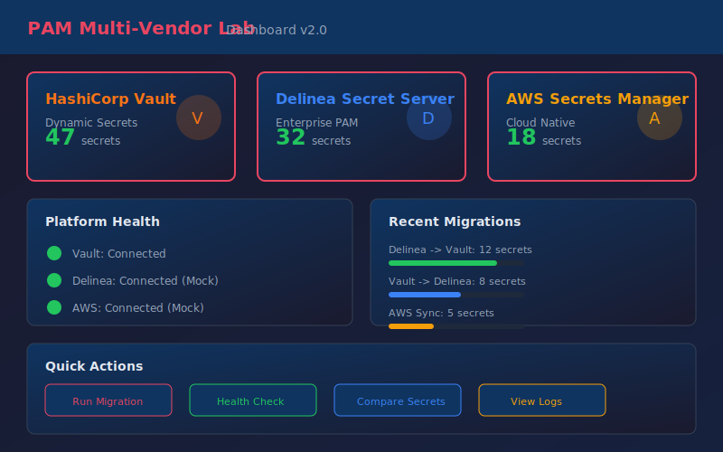

<p align="center">
  
</p>

<h1 align="center">PAM Multi-Vendor Lab</h1>
<h3 align="center">Enterprise Privileged Access Management with HashiCorp Vault, Delinea Secret Server, and AWS Secrets Manager</h3>

<p align="center">
  
  
  
  
  
  
</p>

<p align="center">
  <strong>Production-ready multi-vendor PAM demonstration with cross-platform automation, migration tooling, and unified abstraction layer</strong>
</p>

---

## Why Multi-Vendor PAM?

Modern enterprises rarely use a single PAM solution. This lab demonstrates expertise across multiple platforms:

| Platform | Strength | Best For |
|----------|----------|----------|
| **HashiCorp Vault** | Dynamic secrets, cloud-native | DevOps, microservices, CI/CD |
| **Delinea Secret Server** | Session recording, discovery | Enterprise IT, compliance |
| **AWS Secrets Manager** | Native AWS integration | Cloud workloads, Lambda |

**This lab shows how to:**
* Integrate multiple PAM platforms
* Migrate secrets between platforms
* Build unified automation across vendors
* Make architecture recommendations

---

## What This Repository Demonstrates

### Multi-Vendor PAM Expertise

```
                     PAM Multi-Vendor Architecture
    ================================================================

    ┌─────────────────┐     ┌─────────────────┐     ┌─────────────────┐
    │  HashiCorp      │     │    Delinea      │     │      AWS        │
    │     Vault       │     │  Secret Server  │     │ Secrets Manager │
    │  ─────────────  │     │  ─────────────  │     │  ─────────────  │
    │ * Dynamic creds │     │ * Discovery     │     │ * Native AWS    │
    │ * PKI/certs     │     │ * Session rec   │     │ * Lambda rotate │
    │ * Database      │     │ * Approval flow │     │ * CloudFormation│
    └────────┬────────┘     └────────┬────────┘     └────────┬────────┘
             │                       │                       │
             └───────────────────────┼───────────────────────┘
                                     │
                          ┌──────────▼──────────┐
                          │   Unified PAM       │
                          │      Client         │
                          │  ────────────────   │
                          │ * Cross-platform    │
                          │ * Migration tools   │
                          │ * Health monitoring │
                          │ * Comparison reports│
                          └─────────────────────┘
```

### Key Features

| Feature | Description |
|---------|-------------|
| **Delinea Client** | Full Python client with OAuth2, CRUD, folder management, CLI |
| **Unified Abstraction** | Single interface for all three platforms |
| **Migration Tools** | Bi-directional migration with dry-run support |
| **Mock Mode** | Demo everything without live credentials |
| **Rich CLI** | Professional terminal UI with progress bars |
| **Lab Exercises** | 8 hands-on labs from basics to advanced |

---

## Quick Start

### Prerequisites
* Docker & Docker Compose
* Python 3.10+
* 8GB RAM recommended

### Installation

```bash
# Clone repository
git clone https://github.com/MikeDominic92/pam-multivendor-lab.git
cd pam-multivendor-lab

# Set up Python environment
python -m venv venv
source venv/bin/activate  # Windows: venv\Scripts\activate
pip install -r scripts/requirements.txt

# Configure environment
cp .env.example .env

# Start Vault (Docker)
cd vault
docker-compose up -d
./scripts/init-vault.sh
```

### Run Demo (No Credentials Required)

```bash
# Test Delinea client (mock mode)
python scripts/delinea_client.py --mock demo

# Test unified PAM client
python scripts/unified_pam_client.py demo

# Test migration (dry run)
python scripts/delinea_to_vault.py demo
```

---

## Project Structure

```
pam-multivendor-lab/
├── scripts/                    # Python automation
│   ├── vault_client.py         # Vault operations
│   ├── delinea_client.py       # Delinea operations (NEW)
│   ├── unified_pam_client.py   # Cross-platform abstraction (NEW)
│   ├── vault_to_delinea.py     # Migration tool (NEW)
│   ├── delinea_to_vault.py     # Migration tool (NEW)
│   ├── config.py               # Unified configuration (NEW)
│   └── aws/                    # AWS integration
├── delinea/                    # Delinea resources (NEW)
│   ├── api-examples/           # Python examples
│   ├── powershell/             # PowerShell scripts
│   ├── templates/              # Secret templates
│   └── DELINEA_SETUP.md        # Setup guide
├── vault/                      # Vault configuration
│   ├── config/                 # Vault config files
│   ├── policies/               # ACL policies
│   └── scripts/                # Init scripts
├── labs/                       # Hands-on exercises
│   ├── 01-vault-basics.md
│   ├── 02-secret-management.md
│   ├── 03-dynamic-credentials.md
│   ├── 04-password-rotation.md
│   ├── 05-audit-logging.md
│   ├── 06-delinea-basics.md    # NEW
│   ├── 07-cross-platform-migration.md  # NEW
│   └── 08-unified-pam-operations.md    # NEW
├── docs/                       # Documentation
│   ├── FEATURE_COMPARISON.md   # Platform comparison (NEW)
│   ├── INTERVIEW_TALKING_POINTS.md  # For job prep (NEW)
│   └── ...
├── ARCHITECTURE.md             # Architecture diagrams (NEW)
├── automation/                 # Ansible & PowerShell
├── frontend/                   # React dashboard
└── monitoring/                 # Prometheus & Grafana
```

---

## Platform Feature Comparison

| Feature | CyberArk | Delinea | Vault | AWS SM |
|---------|:--------:|:-------:|:-----:|:------:|
| Password vaulting | ***** | **** | **** | *** |
| Session recording | ***** | *** | * | * |
| Account discovery | ***** | **** | ** | * |
| Dynamic secrets | *** | ** | ***** | ** |
| API automation | ***** | *** | ***** | ***** |
| Cloud deployment | *** | **** | ***** | ***** |
| Open source | No | No | Yes | No |
| Cost | $$$$$ | $$$ | $ | $$ |

**My Recommendation:**
* **Large enterprise, strict compliance** -> CyberArk
* **Mid-market, faster deployment** -> Delinea Secret Server
* **DevOps/cloud-native** -> HashiCorp Vault
* **AWS-native workloads** -> AWS Secrets Manager
* **Hybrid architecture** -> Vault + Delinea together

---

## CLI Commands

### Delinea Client

```bash
# Check connection status
python scripts/delinea_client.py --mock status

# List secrets
python scripts/delinea_client.py --mock list

# Get secret by ID
python scripts/delinea_client.py --mock get 1

# Create secret
python scripts/delinea_client.py --mock create \
  -n "new-secret" -t 3 -f 1 \
  -d "Server=db.example.com" \
  -d "Username=admin" \
  -d "Password=secret123"

# List folders
python scripts/delinea_client.py --mock folders

# List templates
python scripts/delinea_client.py --mock templates
```

### Unified PAM Client

```bash
# Detect available platforms
python scripts/unified_pam_client.py detect

# Health check all platforms
python scripts/unified_pam_client.py health

# Get secret from specific platform
python scripts/unified_pam_client.py get 1 --platform delinea

# Compare secrets across platforms
python scripts/unified_pam_client.py compare 1 "secret/test" \
  --platform1 delinea --platform2 vault
```

### Migration Tools

```bash
# Dry run migration (Delinea -> Vault)
python scripts/delinea_to_vault.py migrate 1 --dry-run

# Migrate entire folder
python scripts/delinea_to_vault.py folder 3 --base-path secret/imported --dry-run

# Generate migration report
python scripts/delinea_to_vault.py migrate 1 --dry-run --output report.json

# Reverse migration (Vault -> Delinea)
python scripts/vault_to_delinea.py migrate secret/test --folder 1 --dry-run
```

---

## Lab Exercises

| Lab | Topic | Duration | Level |
|-----|-------|----------|-------|
| [Lab 01](labs/01-vault-basics.md) | Vault Fundamentals | 30 min | Beginner |
| [Lab 02](labs/02-secret-management.md) | KV Secrets Engine | 30 min | Beginner |
| [Lab 03](labs/03-dynamic-credentials.md) | Dynamic Database Creds | 45 min | Intermediate |
| [Lab 04](labs/04-password-rotation.md) | Automated Rotation | 45 min | Intermediate |
| [Lab 05](labs/05-audit-logging.md) | Audit & Compliance | 30 min | Intermediate |
| [Lab 06](labs/06-delinea-basics.md) | **Delinea Basics** | 30 min | Beginner |
| [Lab 07](labs/07-cross-platform-migration.md) | **Cross-Platform Migration** | 45 min | Advanced |
| [Lab 08](labs/08-unified-pam-operations.md) | **Unified PAM Client** | 30 min | Advanced |

---

## Documentation

| Document | Description |
|----------|-------------|
| [ARCHITECTURE.md](ARCHITECTURE.md) | Multi-vendor architecture with Mermaid diagrams |
| [docs/FEATURE_COMPARISON.md](docs/FEATURE_COMPARISON.md) | Detailed platform comparison matrix |
| [docs/INTERVIEW_TALKING_POINTS.md](docs/INTERVIEW_TALKING_POINTS.md) | PAM Architect interview preparation |
| [delinea/DELINEA_SETUP.md](delinea/DELINEA_SETUP.md) | Delinea Secret Server setup guide |
| [docs/VAULT_SETUP.md](docs/VAULT_SETUP.md) | HashiCorp Vault setup guide |

---

## Certifications Aligned

This lab supports preparation for:

* **CyberArk PAM-DEF** (Defender) - Vault concepts map to CyberArk components
* **Delinea Security Academy** - Direct Delinea experience
* **HashiCorp Vault Associate** - Full Vault operations
* **HashiCorp Vault Operations Professional** - Advanced patterns
* **AWS Security Specialty** - Secrets Manager integration

---

## Cost Analysis

| Component | Cost | Notes |
|-----------|------|-------|
| HashiCorp Vault | $0 | Open source |
| Delinea (demo) | $0 | Mock mode / 30-day trial |
| AWS (demo) | $0 | Mock mode |
| Docker/Compose | $0 | Free |
| **Total** | **$0** | vs CyberArk $50K+/year |

---

## Skills Demonstrated

| Category | Technologies |
|----------|-------------|
| **PAM** | Vault, Delinea, CyberArk concepts, AWS SM |
| **Cloud** | AWS, multi-cloud patterns |
| **Infrastructure** | Docker, Prometheus, Grafana |
| **Automation** | Python, Ansible, PowerShell |
| **Security** | Dynamic creds, rotation, audit |
| **Architecture** | Cross-platform migration, abstraction |

---

## Roadmap

* [x] **v1.0**: Core Vault lab with databases and monitoring
* [x] **v1.1**: AWS Secrets Manager integration
* [x] **v2.0**: Delinea integration, unified client, migration tools
* [ ] **v2.1**: Azure Key Vault integration
* [ ] **v2.2**: Google Cloud Secret Manager
* [ ] **v3.0**: HashiCorp Boundary for session management

---

## Author

**Dominic M. Hoang** | PAM & Identity Security Professional

* Multi-vendor PAM expertise (Vault, Delinea, CyberArk concepts)
* CyberArk PAM-DEF aligned
* Focus: Enterprise PAM architecture and automation

GitHub: [@MikeDominic92](https://github.com/MikeDominic92)

---

## License

MIT License - See [LICENSE](LICENSE) for details.

---

<p align="center">
  <strong>Enterprise Multi-Vendor PAM at Zero Cost</strong>
  <br/>
  <sub>Built for PAM Architect roles requiring CyberArk, Delinea, Thycotic, Centrify expertise</sub>
</p>
