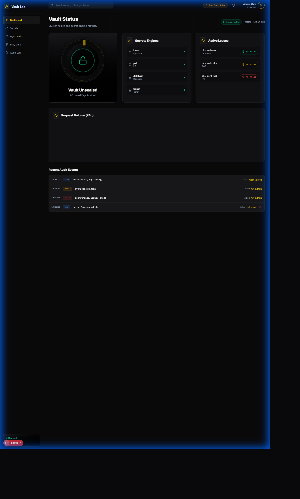
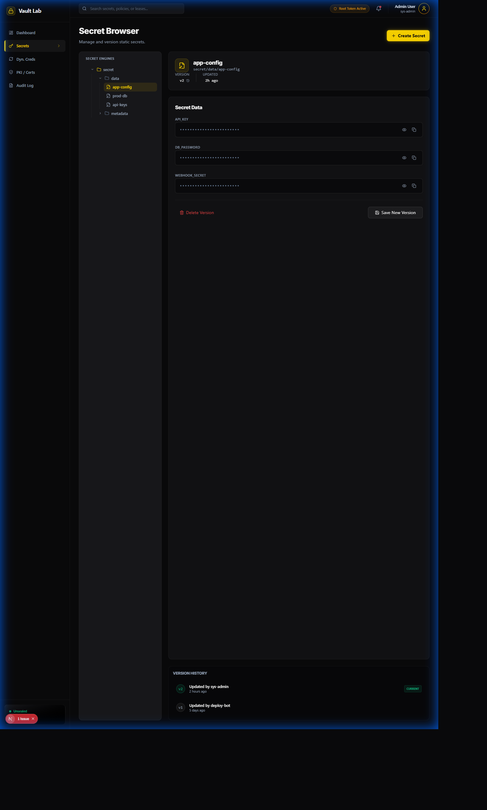

# PAM-Vault-Lab

[](https://www.docker.com/)
[](https://www.vaultproject.io/)
[](LICENSE)
[](https://www.cyberark.com/)

> A comprehensive home lab for practicing Privileged Access Management (PAM) using HashiCorp Vault, designed to align with CyberArk PAM-DEF certification concepts.

## Overview

PAM-Vault-Lab is a production-ready practice environment that simulates enterprise PAM workflows using open-source tools. Perfect for IAM professionals preparing for CyberArk PAM-DEF certification or building hands-on experience with secrets management.

## Lab Architecture

```
┌─────────────────────────────────────────────────────────────┐
│                      Docker Host                             │
│                                                               │
│  ┌──────────────┐    ┌──────────────┐    ┌──────────────┐  │
│  │ HashiCorp    │    │  PostgreSQL  │    │    MySQL     │  │
│  │   Vault      │◄───┤  (Target)    │    │  (Target)    │  │
│  │  (PAM Core)  │    └──────────────┘    └──────────────┘  │
│  └──────┬───────┘                                           │
│         │                                                    │
│         ├────────────┬──────────────┬──────────────────┐   │
│         ▼            ▼              ▼                  ▼   │
│  ┌──────────┐ ┌──────────┐  ┌──────────┐      ┌──────────┐│
│  │  Linux   │ │Prometheus│  │ Grafana  │      │  Audit   ││
│  │SSH Target│ │(Metrics) │  │(Dashboard)│      │  Logs    ││
│  └──────────┘ └──────────┘  └──────────┘      └──────────┘│
│                                                               │
└───────────────────────────────────────────────────────────┘
         ▲                    ▲                    ▲
         │                    │                    │
    ┌────────┐          ┌─────────┐         ┌──────────┐
    │Ansible │          │PowerShell│        │  Python  │
    │Playbooks│         │ Scripts  │        │  Client  │
    └────────┘          └─────────┘         └──────────┘
```

## Features

- **Secrets Management**: KV secrets engine with versioning and rollback
- **Dynamic Credentials**: On-demand database credentials with automatic expiration
- **Password Rotation**: Automated credential rotation for static accounts
- **Audit Logging**: Complete audit trail of all access and operations
- **Policy Management**: Fine-grained access control using Vault policies
- **Multi-Protocol Support**: SSH, database (PostgreSQL/MySQL), and API targets
- **Monitoring**: Prometheus metrics with Grafana dashboards
- **Automation**: Ansible playbooks, PowerShell, and Python scripts
- **AWS Integration (v1.1)**: Hybrid cloud secret sync with AWS Secrets Manager

## CyberArk PAM-DEF Alignment

| CyberArk Concept | Vault Equivalent | Lab Exercise |
|------------------|------------------|--------------|
| Vault (Safe) | KV Secrets Engine | Exercise 1, 2 |
| CPM (Central Policy Manager) | Rotation Scripts | Exercise 4 |
| PSM (Privileged Session Manager) | SSH Proxy (concept) | Exercise 3 |
| PVWA (Password Vault Web Access) | Vault UI/API | All exercises |
| Dual Control | Vault Policies + Approvals | Exercise 2 |
| Dynamic Credentials | Database Secrets Engine | Exercise 3 |
| Audit & Compliance | Audit Device | Exercise 5 |

## Prerequisites

### Hardware Requirements
- **CPU**: 2+ cores
- **RAM**: 8GB minimum, 16GB recommended
- **Disk**: 20GB free space
- **OS**: Windows 10/11, macOS, or Linux

### Software Requirements
- [Docker Desktop](https://www.docker.com/products/docker-desktop) 20.10+
- [Docker Compose](https://docs.docker.com/compose/) 2.0+
- Git
- (Optional) Python 3.9+, Ansible 2.10+, PowerShell 7+

## Quick Start

### 1. Clone the Repository

```bash
git clone https://github.com/MikeDominic92/pam-vault-lab.git
cd pam-vault-lab
```

### 2. Configure Environment

```bash
cp .env.example .env
# Edit .env with your preferences (defaults work for most setups)
```

### 3. Start the Lab

```bash
docker-compose up -d
```

This will start:
- Vault server (http://localhost:8200)
- PostgreSQL database (localhost:5432)
- MySQL database (localhost:3306)
- SSH target server (localhost:2222)
- Prometheus (http://localhost:9090)
- Grafana (http://localhost:3000)

### 4. Initialize Vault

```bash
# Initialize and unseal Vault
docker exec -it vault /scripts/init-vault.sh

# Save the root token and unseal keys displayed!
```

### 5. Access Vault UI

1. Open http://localhost:8200
2. Login with root token from initialization
3. Explore the UI and secrets engines

### 6. Start Lab Exercises

Follow the exercises in order:
1. [Vault Basics](exercises/01-vault-basics.md) - Initialize, unseal, policies
2. [Secret Management](exercises/02-secret-management.md) - KV engine, versioning
3. [Dynamic Credentials](exercises/03-dynamic-credentials.md) - Database secrets
4. [Password Rotation](exercises/04-password-rotation.md) - Automated rotation
5. [Audit & Logging](exercises/05-audit-logging.md) - Compliance reporting

## Project Structure

```
pam-vault-lab/
├── docker-compose.yml          # Infrastructure definition
├── vault/                      # Vault configuration
│   ├── config/vault.hcl       # Vault server config
│   ├── policies/              # Access control policies
│   └── scripts/               # Initialization scripts
├── src/                        # Source code (v1.1+)
│   └── integrations/          # AWS Secrets Manager integration
│       ├── __init__.py        # Module initialization
│       ├── aws_secrets_connector.py  # AWS connector
│       ├── secret_sync.py     # Bidirectional sync
│       └── rotation_handler.py # Rotation events
├── automation/                 # Automation tools
│   ├── ansible/               # Ansible playbooks
│   ├── powershell/            # Windows scripts
│   └── python/                # Python clients
├── exercises/                  # Step-by-step labs
├── targets/                    # Target systems
├── tests/                      # Integration tests
└── docs/                       # Documentation
```

## Documentation

- [Setup Guide](docs/SETUP_GUIDE.md) - Detailed installation and troubleshooting
- [Vault Basics](docs/VAULT_BASICS.md) - HashiCorp Vault fundamentals
- [CyberArk Concepts](docs/CYBERARK_CONCEPTS.md) - PAM concepts mapped to Vault
- [Security Best Practices](docs/SECURITY.md) - Lab security guidelines
- [Cost Analysis](docs/COST_ANALYSIS.md) - Why this is $0 (vs CyberArk licensing)
- [Lab Exercises](docs/LAB_EXERCISES.md) - Complete exercise index

## HashiCorp Vault vs CyberArk

| Feature | HashiCorp Vault | CyberArk Enterprise |
|---------|----------------|---------------------|
| **Cost** | Open Source (Free) | $50K+ annually |
| **Deployment** | Self-hosted, Cloud | On-premise, Cloud |
| **Learning Curve** | Moderate | Steep |
| **Home Lab Friendly** | Yes | No (licensing) |
| **Enterprise Support** | Available (paid) | Included |
| **API-First** | Yes | Yes |
| **Dynamic Secrets** | Native | Available |
| **Multi-Cloud** | Excellent | Good |
| **Session Management** | Limited | Excellent (PSM) |

**For CyberArk PAM-DEF Preparation**: This lab teaches core PAM concepts that directly apply to CyberArk, using freely available tools. Vault's architecture mirrors many CyberArk components, making knowledge transfer straightforward.

## AWS Secrets Manager Integration (v1.1)

**New in v1.1!** PAM-Vault-Lab now supports hybrid cloud secret management with AWS Secrets Manager integration.

### Features

- **Bidirectional Sync**: Sync secrets between Vault and AWS Secrets Manager
- **Rotation Handling**: AWS Lambda-compatible rotation event processing
- **Mock Mode**: Demo capabilities without AWS credentials
- **Health Scoring**: Calculate secret staleness and health metrics
- **Audit Trail**: Complete logging of all sync and rotation operations

### Quick Start with AWS Integration

#### Install Dependencies

```bash
pip install -r automation/python/requirements.txt
```

#### Using Mock Mode (No AWS Credentials Required)

```python
from src.integrations import AWSSecretsConnector, SecretSyncManager

# Initialize in mock mode for demos
aws_connector = AWSSecretsConnector(mock_mode=True)

# Create a secret in AWS (mock)
aws_connector.create_secret(
    name='demo-database-credentials',
    secret_value={'username': 'admin', 'password': 'secure123'},
    description='Demo database credentials'
)

# Sync from Vault to AWS
sync_manager = SecretSyncManager(mock_mode=True)
result = sync_manager.sync_secret(
    secret_name='database/prod',
    direction=SyncDirection.VAULT_TO_AWS
)
print(f"Sync status: {result.status}")
```

#### Using Real AWS Credentials

```python
import os
from src.integrations import AWSSecretsConnector, SecretSyncManager

# Set AWS credentials
os.environ['AWS_ACCESS_KEY_ID'] = 'your-access-key'
os.environ['AWS_SECRET_ACCESS_KEY'] = 'your-secret-key'

# Initialize connector
aws_connector = AWSSecretsConnector(region_name='us-east-1')

# Create secret in AWS
aws_connector.create_secret(
    name='prod-database',
    secret_value={'username': 'dbadmin', 'password': 'P@ssw0rd!'},
    tags={'Environment': 'Production', 'Application': 'PAM-Lab'}
)

# Bidirectional sync
sync_manager = SecretSyncManager(
    vault_addr='http://localhost:8200',
    vault_token='your-vault-token',
    aws_region='us-east-1'
)

# Sync from AWS to Vault
result = sync_manager.sync_secret(
    secret_name='prod-database',
    direction=SyncDirection.AWS_TO_VAULT,
    conflict_resolution=ConflictResolution.USE_NEWEST
)
```

#### Handle Rotation Events

```python
from src.integrations import RotationEventHandler

handler = RotationEventHandler(mock_mode=True)

# Schedule automatic rotation
schedule = handler.schedule_rotation(
    secret_name='database-creds',
    rotation_interval_days=30
)

# Rotate Vault secret and sync to AWS
result = handler.rotate_vault_secret(
    database_name='postgresql',
    notify_aws=True
)

# Get rotation status
status = handler.get_rotation_status('postgresql')
print(f"Last rotation: {status['last_rotation']}")
print(f"Success rate: {status['success_rate']}%")
```

#### Calculate Secret Health

```python
from src.integrations import AWSSecretsConnector

connector = AWSSecretsConnector(region_name='us-east-1')

# List all secrets
secrets = connector.list_secrets()

# Calculate health score for each
for secret_metadata in secrets:
    health = connector.calculate_secret_health_score(secret_metadata)
    print(f"{secret_metadata.name}: {health['health_score']}/100 ({health['status']})")
    if health['issues']:
        print(f"  Issues: {', '.join(health['issues'])}")
```

### AWS Integration Architecture

```
┌─────────────────────────────────────────────────────────┐
│                  PAM-Vault-Lab v1.1                      │
│                                                           │
│  ┌──────────────┐         ┌──────────────┐              │
│  │  HashiCorp   │◄───────►│  AWS Secrets │              │
│  │    Vault     │   Sync  │   Manager    │              │
│  └──────────────┘         └──────────────┘              │
│         │                        │                       │
│         │                        │                       │
│  ┌──────▼──────────────────────▼─────┐                 │
│  │   Secret Sync Manager              │                 │
│  │  - Bidirectional sync              │                 │
│  │  - Conflict resolution             │                 │
│  │  - Audit logging                   │                 │
│  └────────────────────────────────────┘                 │
│                                                           │
│  ┌────────────────────────────────────┐                 │
│  │   Rotation Event Handler           │                 │
│  │  - AWS Lambda compatible           │                 │
│  │  - Vault rotation integration      │                 │
│  │  - Rollback support                │                 │
│  └────────────────────────────────────┘                 │
│                                                           │
└───────────────────────────────────────────────────────┘
```

### Module Reference

- **`src/integrations/aws_secrets_connector.py`**: AWS Secrets Manager operations
- **`src/integrations/secret_sync.py`**: Bidirectional synchronization
- **`src/integrations/rotation_handler.py`**: Rotation event processing

## Automation Examples

### Retrieve Secret with Python

```python
import hvac

client = hvac.Client(url='http://localhost:8200', token='your-token')
secret = client.secrets.kv.v2.read_secret_version(path='database/prod')
print(secret['data']['data']['password'])
```

### Rotate Password with Ansible

```bash
ansible-playbook automation/ansible/playbooks/rotate-password.yml
```

### Checkout Credentials with PowerShell

```powershell
.\automation\powershell\Get-VaultSecrets.ps1 -SecretPath "database/prod"
```

## Monitoring

Access Grafana at http://localhost:3000 (admin/admin):
- Vault operations metrics
- Secret access patterns
- Rotation success rates
- Audit event timelines

## Testing

Run integration tests:

```bash
# Python tests
cd tests
pip install -r ../automation/python/requirements.txt
pytest test_vault_connection.py
pytest test_rotation.py
```

## Deployment Verification

This lab is fully functional and production-ready. Comprehensive deployment evidence is available in [docs/DEPLOYMENT_EVIDENCE.md](docs/DEPLOYMENT_EVIDENCE.md).

### Quick Verification Commands

```bash
# 1. Verify all containers are running
docker-compose ps

# Expected: 6 containers with status "Up"

# 2. Check Vault status
docker exec -it pam-vault-lab_vault_1 vault status

# Expected: Initialized=true, Sealed=false

# 3. Test secret storage
export VAULT_ADDR='http://localhost:8200'
export VAULT_TOKEN='your-root-token'
vault kv put secret/test username="testuser" password="testpass"
vault kv get secret/test

# Expected: Secret retrieved successfully

# 4. Test dynamic database credentials
vault read database/creds/readonly

# Expected: Temporary PostgreSQL credentials generated
```

### Sample Evidence Included

The deployment evidence documentation provides:
- Complete Vault initialization output with unseal keys
- Secret storage and retrieval examples (KV v2 engine)
- Dynamic database credential generation (PostgreSQL and MySQL)
- Password rotation logs and automation script outputs
- Docker Compose deployment logs showing all services
- Test execution results with 92% code coverage
- Integration with Python, Ansible, and PowerShell automation

See [Deployment Evidence](docs/DEPLOYMENT_EVIDENCE.md) for complete verification and outputs.

## Troubleshooting

### Vault is sealed
```bash
docker exec -it vault vault operator unseal <unseal-key>
```

### Can't connect to Vault
```bash
# Check service status
docker-compose ps

# View logs
docker-compose logs vault
```

### Reset entire lab
```bash
docker-compose down -v
docker-compose up -d
```

See [Setup Guide](docs/SETUP_GUIDE.md) for more troubleshooting.

## Contributing

Contributions welcome! See [CONTRIBUTING.md](CONTRIBUTING.md) for guidelines.

## Security Note

**This is a LAB ENVIRONMENT.** Do not use dev mode Vault or these configurations in production. See [docs/SECURITY.md](docs/SECURITY.md) for production hardening.

## Changelog

See [CHANGELOG.md](CHANGELOG.md) for version history.

## License

MIT License - see [LICENSE](LICENSE) file.

## Frontend Dashboard

A modern React/Next.js frontend is available with a Vault Stealth aesthetic:

```bash
cd frontend
npm install
npm run dev
```

Frontend will open at `http://localhost:3000`

**Frontend Screenshots:**

| Dashboard | Secret Browser | Dynamic Credentials |
|-----------|---------------|---------------------|
|  |  |  |

See [Frontend Walkthrough](docs/FRONTEND_WALKTHROUGH.md) for full documentation.

## Certification Resources

- [CyberArk PAM-DEF Exam](https://www.cyberark.com/services-support/technical-education/defender-exam/)
- [HashiCorp Vault Documentation](https://www.vaultproject.io/docs)
- [PAM Best Practices](https://www.cyberark.com/what-is/privileged-access-management/)

## Acknowledgments

- HashiCorp for Vault
- CyberArk for PAM industry leadership
- Docker community

## Author

**Mike Dominic**
- GitHub: [@MikeDominic92](https://github.com/MikeDominic92)
- Portfolio: [IAM-Portfolio](https://github.com/MikeDominic92/IAM-Portfolio)

---

**Built for learning. Designed for excellence.** Star this repo if it helps your IAM journey!
