<h1 align="center">PAM Multi-Vendor Lab</h1>
<h3 align="center">Enterprise Privileged Access Management Platform</h3>

<p align="center">
  
  
  
  
  
</p>

<p align="center">
  
  
  
  
</p>

---

<div align="center">

### What is PAM Multi-Vendor Lab?

**PAM Multi-Vendor Lab is a production-ready demonstration of enterprise privileged access management across HashiCorp Vault, Delinea Secret Server, and AWS Secrets Manager - featuring an award-winning cybersecurity dashboard with modern 2026 design aesthetics.**

</div>

<div align="center">

### The Problem It Solves

Modern enterprises rarely use a single PAM solution. CyberArk dominates large enterprise. Delinea serves mid-market. Vault powers DevOps. AWS Secrets Manager handles cloud workloads. PAM architects need expertise across all platforms, but vendor-specific training and isolated lab environments make cross-platform skills difficult to develop.

</div>

<div align="center">

### The Solution

PAM Multi-Vendor Lab provides a unified environment to learn, compare, and automate across three major PAM platforms. A Python abstraction layer enables cross-platform secret management. Migration tools move secrets bidirectionally between platforms. Mock modes allow full demonstrations without live credentials.

**Result: Multi-vendor PAM expertise. Cross-platform automation. Zero licensing cost.**

</div>

---

<p align="center">
  <a href="#overview">Overview</a> |
  <a href="#frontend-dashboard">Dashboard</a> |
  <a href="#platform-screenshots">Screenshots</a> |
  <a href="#technical-problem-solving">Problem Solving</a> |
  <a href="#key-features">Features</a> |
  <a href="#architecture">Architecture</a> |
  <a href="#quick-start">Quick Start</a>
</p>

---

<div align="center">

## Frontend Dashboard

### Award-Winning Cybersecurity UI

The PAM Multi-Vendor Lab features a modern, award-winning dashboard built with Next.js 16, React 19, and TailwindCSS v4. The design follows 2026 UI trends with a "Dark Glassmorphism + Cyber Elegance" aesthetic.

</div>

### Design System

| Element | Description |
|:--------|:------------|
| **Theme** | Dark Glassmorphism with frosted glass panels, blur effects, and ambient gradients |
| **Primary Color** | Cyber Cyan (#00f5ff) - Used for primary actions and active states |
| **Accent Colors** | Electric Purple (#a855f7), Neon Emerald (#10b981), Vault Gold (#fbbf24), Plasma Pink (#ec4899) |
| **Typography** | Inter for body text, Orbitron for headers, Fira Code for monospace |
| **Animations** | Framer Motion v12 for smooth micro-interactions and page transitions |

### Dashboard Pages

| Page | Features |
|:-----|:---------|
| **Security Dashboard** | Real-time metrics with sparklines, platform health cards, API request volume charts, system health progress rings, platform distribution pie chart, secret types breakdown, recent audit events |
| **Secrets Browser** | Multi-platform tree navigator (Delinea/AWS/Vault), search with filtering, secret details with glassmorphism cards, version history |
| **Dynamic Credentials** | Credential generator with backend selection (Database/AWS IAM), role and TTL configuration, active leases table with countdown timers |
| **PKI Authority** | Certificate issuance wizard, certificate chain visualization, expiring certificates alerts, revocation status tracking |
| **Audit & Policies** | Live audit stream with staggered animations, filter pills with neon selection states, HCL policy editor with line numbers, policy security scoring |

### UI Component Library

| Component | Description |
|:----------|:------------|
| **VaultShell** | Main layout wrapper with glassmorphism sidebar and floating header |
| **GlassButton** | Glassmorphism button with variants (primary, secondary, ghost, danger) and glow effects |
| **NeonBadge** | Status badges with neon glow in multiple color variants |
| **LeaseTimer** | Animated countdown timer with progress bar and critical state detection |
| **VaultCard** | Glass card component with accent colors and hover effects |
| **ChartTheme** | Custom Recharts theming with gradients, tooltips, sparklines, and progress rings |
| **Toast** | Notification system with glass styling and auto-dismiss |
| **Skeleton** | Loading state components with shimmer animations |

### Accessibility & Performance

| Feature | Implementation |
|:--------|:---------------|
| **Reduced Motion** | Comprehensive `prefers-reduced-motion` support for all animations |
| **High Contrast** | Enhanced border visibility for `prefers-contrast: high` |
| **Keyboard Navigation** | Skip-to-content link, focus-visible states with neon glow |
| **Screen Readers** | Semantic HTML, ARIA labels, sr-only utility class |
| **WCAG Compliance** | 4.5:1 minimum contrast ratios for text content |

### Tech Stack

```
frontend/
├── Next.js 16 + React 19
├── TailwindCSS v4
├── Framer Motion v12
├── Recharts (data visualization)
├── Lucide React (icons)
└── TypeScript
```

---

<div align="center">

## Overview

### The Challenge

| Challenge | Impact |
|:---------:|:------:|
| **60% of breaches** involve compromised credentials | Verizon DBIR |
| **PAM fragmentation** across 3-5 platforms per enterprise | Industry average |
| **$50K+ annually** for CyberArk licensing alone | Enterprise pricing |
| **Vendor lock-in** limits architecture flexibility | Migration difficulty |

### The Solution

| Capability | Result |
|:----------:|:------:|
| **Multi-Platform Abstraction** | Single API for Vault, Delinea, AWS |
| **Bi-directional Migration** | Move secrets between any platforms |
| **Award-Winning Dashboard** | Modern cybersecurity UI |
| **8 Lab Exercises** | Hands-on learning path |

</div>

---

<div align="center">

## Why PAM Multi-Vendor Lab

| Capability | Single Vendor | PAM Multi-Vendor Lab |
|:-----------|:--------------:|:--------------------:|
| **Platform Coverage** | 1 platform | 3 platforms |
| **Migration Tools** | Manual export/import | Automated with dry-run |
| **Cross-Platform API** | None | Unified abstraction |
| **Dashboard UI** | Basic | Award-winning glassmorphism |
| **Lab Environment** | Vendor-specific | Multi-vendor |
| **Architecture Comparison** | Limited | Side-by-side |

</div>

---

<div align="center">

## Platform Screenshots

**Award-winning v2.5 Dashboard with Dark Glassmorphism Design**

### Security Dashboard


*Real-time security metrics with multi-platform monitoring across Vault, Delinea, and AWS*

| Feature | Description |
|:--------|:------------|
| **Glassmorphism Cards** | Frosted glass panels with backdrop blur and subtle borders |
| **Animated Stat Cards** | Real-time metrics (2,847 secrets, 156 active sessions, 45.2K API requests) |
| **Vault Status** | Live vault seal status with unseal key visualization |
| **Platform Health** | Connection status for Delinea (847 secrets), AWS (1,234 secrets), HashiCorp Vault |
| **Active Leases** | Dynamic credential countdown timers with role information |
| **API Request Volume** | Area chart showing 24-hour request and error trends |
| **Platform Distribution** | Pie chart breakdown of secrets by platform |
| **System Health** | CPU, Memory, and Storage utilization rings |

---

### Secrets Browser

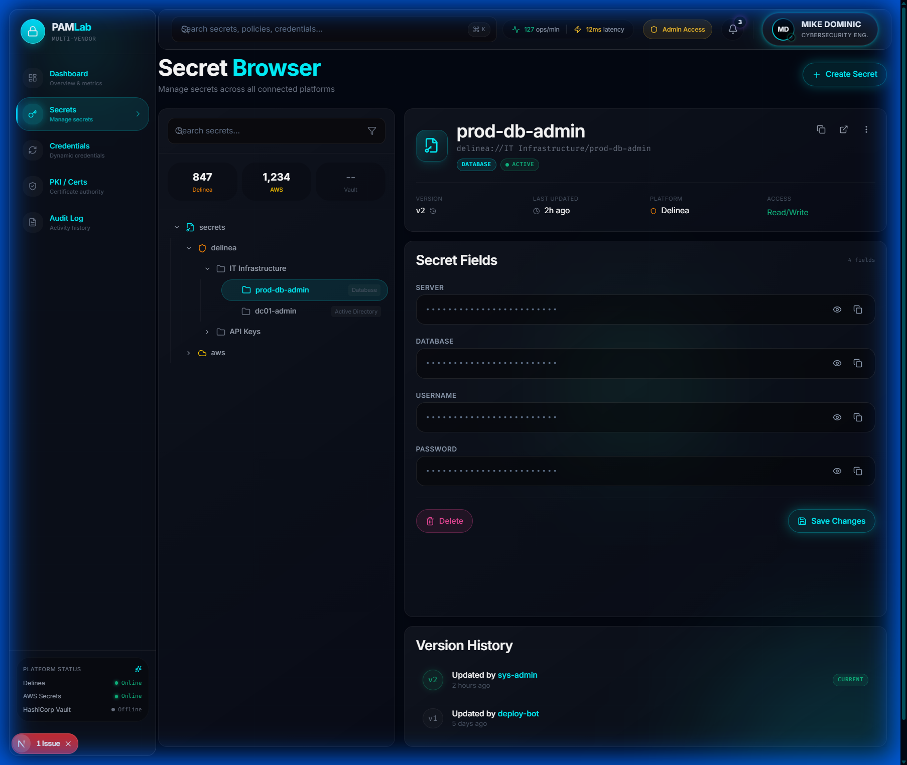

*Unified secret management across all connected PAM platforms*

| Feature | Description |
|:--------|:------------|
| **Tree Navigator** | Hierarchical view of secrets organized by platform (Delinea, AWS, Vault) |
| **Folder Structure** | IT Infrastructure, API Keys, and custom folder organization |
| **Secret Details** | Full secret view with server, database, username, and password fields |
| **Version History** | Track changes with actor attribution and timestamps |
| **Platform Badges** | Visual indicators showing source platform for each secret |
| **Copy Actions** | One-click copy for sensitive field values |

---

### Dynamic Credentials

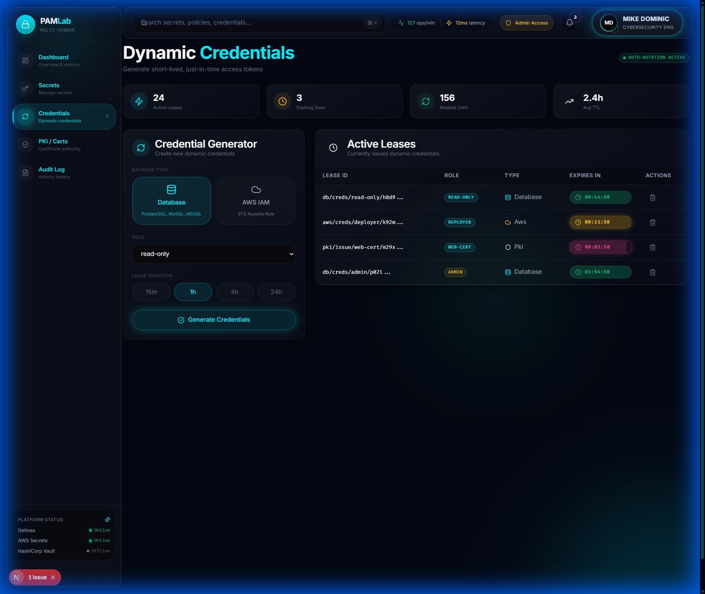

*Just-in-time credential generation with automatic expiration*

| Feature | Description |
|:--------|:------------|
| **Credential Generator** | Request credentials for Database (PostgreSQL, MySQL, MSSQL) or AWS IAM |
| **Role Selection** | Choose from read-only, admin, deployer, and custom roles |
| **TTL Configuration** | Set lease duration from 15 minutes to 24 hours |
| **Active Leases Table** | Monitor all active credentials with expiration countdowns |
| **Platform Indicators** | Visual badges showing credential type (Database, AWS, PKI) |
| **Auto-Rotation Stats** | Track average TTL and credential lifecycle metrics |

---

### PKI Authority

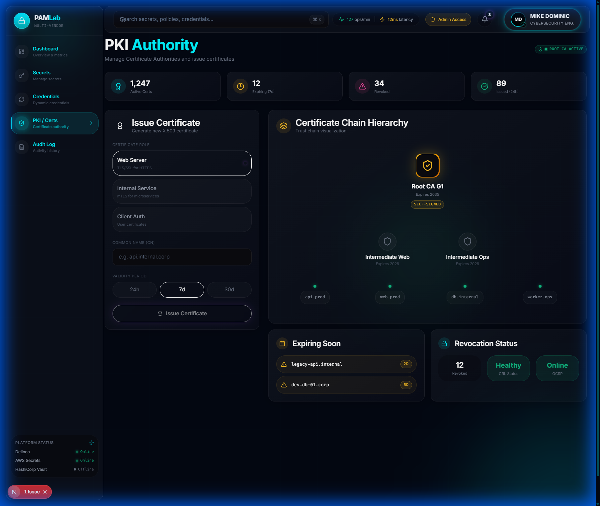

*Enterprise certificate management with visual trust chain hierarchy*

| Feature | Description |
|:--------|:------------|
| **Certificate Metrics** | Active certs (1,247), Expiring (12), Revoked (34), Issued today (89) |
| **Issue Certificate Wizard** | Generate certificates for Web Server, Internal Service, or Client Auth |
| **Certificate Chain Visualization** | Interactive tree showing Root CA → Intermediate CAs → End entities |
| **Expiring Soon Alerts** | Proactive warnings for certificates nearing expiration |
| **Revocation Status** | Health status and online/offline CRL distribution points |
| **Common Name Input** | Domain validation with real-time formatting |

---

### Audit & Policies


*HCL policy editor with security scoring and capability analysis*

| Feature | Description |
|:--------|:------------|
| **ACL Policy List** | Manage admin-policy, app-read-only, pki-issuer, db-creds-rotator, deployment-bot |
| **HCL Policy Editor** | Syntax-highlighted editor with line numbers and path definitions |
| **Capabilities Display** | Visual badges for READ, LIST, CREATE, UPDATE, DENY permissions |
| **Path Coverage** | Track the number of paths protected by each policy |
| **Security Score** | A-F grading based on least-privilege compliance |
| **Create New Policy** | Guided workflow for defining new access policies |

---

### Live Audit Stream

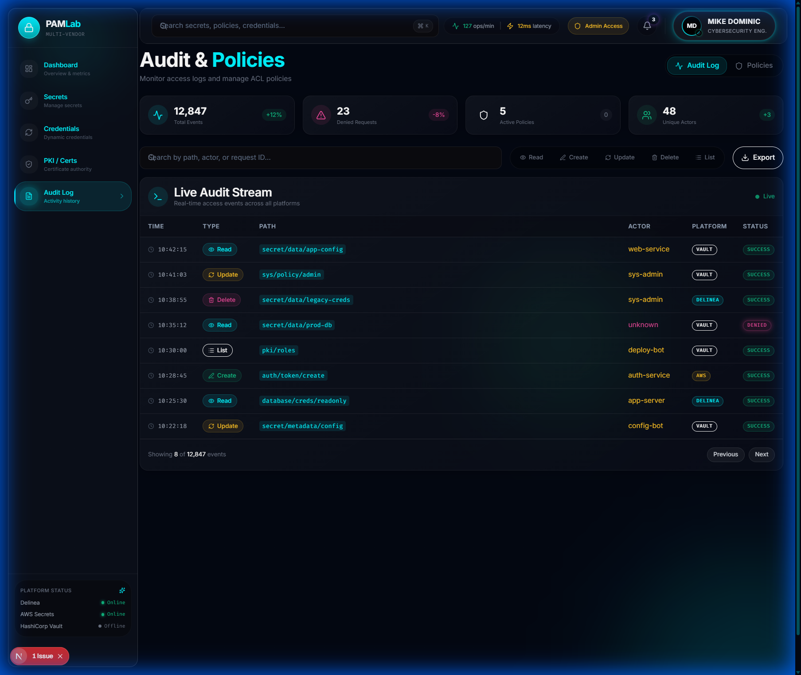

*Real-time access monitoring across all PAM platforms*

| Feature | Description |
|:--------|:------------|
| **12,847 Total Events** | Comprehensive audit trail with 23 denied requests |
| **Live Event Stream** | Real-time updates with timestamp, action type, and path |
| **Platform Filtering** | View events from Vault, Delinea, or AWS independently |
| **Action Type Badges** | Color-coded Read, Update, Create, Delete, List operations |
| **Actor Attribution** | Track which service accounts and users performed actions |
| **Export Capability** | Download audit logs for compliance and forensics |

---

### Color Palette

| Color | Hex | Usage |
|:------|:----|:------|
| Obsidian | `#030712` | Page background |
| Cyber Cyan | `#00f5ff` | Primary accent, active states |
| Electric Purple | `#a855f7` | Secondary accent |
| Neon Emerald | `#10b981` | Success states |
| Vault Gold | `#fbbf24` | Premium features |
| Plasma Pink | `#ec4899` | Warnings, alerts |

---

### CLI Demos

**Delinea Client** - Full-featured Python client with OAuth2 authentication and mock mode

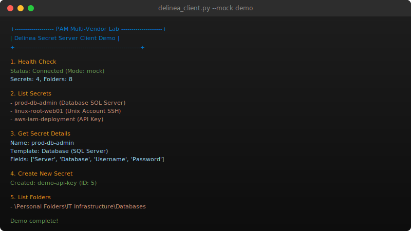

---

**Unified PAM Client** - Cross-platform abstraction layer with health checks and secret comparison

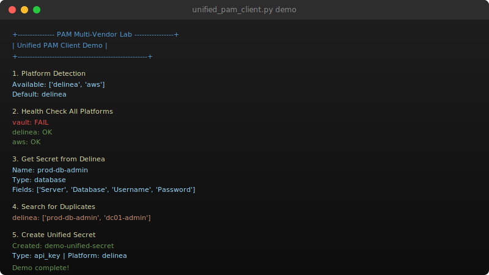

---

**Migration Tools** - Bi-directional migration with dry-run, field mapping, and JSON reports

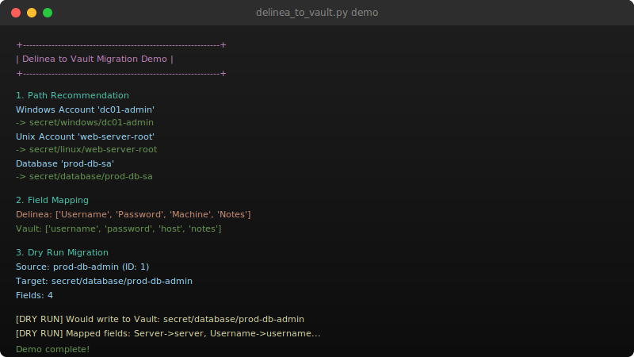

</div>

---

<h2 align="center">Technical Problem Solving</h2>

<p align="center"><em>Real enterprise PAM challenges and the architectural solutions I built to solve them.</em></p>

<div align="center">

<h3>Challenge 1: Multi-Vendor Secret Management</h3>

> *"How do you manage secrets across Vault, Delinea, and AWS with a single workflow?"*

**My Answer:** Abstract the platforms behind a unified interface.

| Component | Description |
|:----------|:------------|
| **Platform Adapters** | VaultAdapter, DelineaAdapter, AWSAdapter with consistent methods |
| **UnifiedSecret Model** | Platform-agnostic secret representation |
| **Auto-Detection** | Discover available platforms from environment |
| **Health Monitoring** | Check connectivity across all platforms simultaneously |
| **Result** | One API, three platforms, zero vendor lock-in |

**Solution Architecture:**

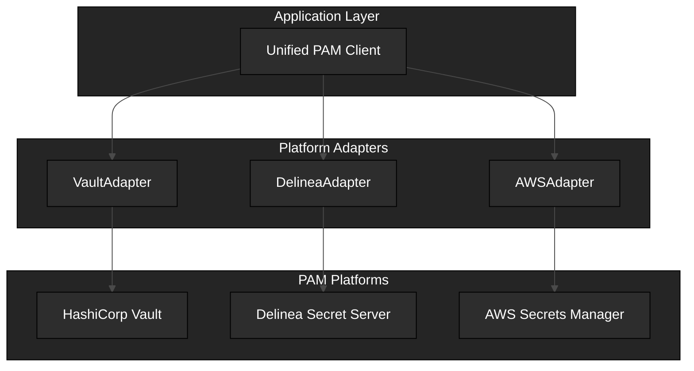

| Metric | Impact |
|:------:|:------:|
| Platforms supported | **3** |
| API consistency | **100%** |
| Vendor lock-in | **Eliminated** |

</div>

---

<div align="center">

<h3>Challenge 2: Cross-Platform Migration</h3>

> *"How do you migrate 500 secrets from Delinea to Vault without data loss?"*

**My Answer:** Dry-run everything. Map fields intelligently. Generate audit trails.

| Component | Description |
|:----------|:------------|
| **Dry-Run Mode** | Preview migration without executing |
| **Field Mapping** | Delinea fields map to Vault paths automatically |
| **Template Detection** | Windows Account, Unix SSH, Database, API Key templates |
| **Path Recommendation** | Intelligent Vault path suggestions based on secret type |
| **JSON Reports** | Complete audit trail of migration operations |
| **Result** | Zero-risk migration with full visibility |

**Solution Architecture:**

```mermaid
%%{init: {'theme': 'base', 'themeVariables': { 'primaryColor': '#2d2d2d', 'primaryTextColor': '#ffffff', 'primaryBorderColor': '#000000', 'lineColor': '#4a4a4a', 'secondaryColor': '#3a3a3a', 'tertiaryColor': '#1a1a1a', 'background': '#1a1a1a', 'mainBkg': '#2d2d2d', 'nodeBorder': '#000000', 'clusterBkg': '#252525', 'clusterBorder': '#000000', 'titleColor': '#ffffff', 'edgeLabelBackground': '#2d2d2d'}}}%%
flowchart LR
    subgraph Source["Source Platform"]
        A[Delinea Secret Server]
        B[Secret with Template]
    end

    subgraph Migration["Migration Engine"]
        C[Read Secret]
        D[Detect Template Type]
        E[Map Fields]
        F[Generate Vault Path]
        G[Dry-Run Preview]
    end

    subgraph Target["Target Platform"]
        H[HashiCorp Vault]
        I[KV v2 Secret]
    end

    A --> B --> C --> D --> E --> F --> G --> H --> I
```

</div>

---

<div align="center">

<h3>Challenge 3: Platform Selection</h3>

> *"When should I use Vault vs Delinea vs CyberArk vs AWS?"*

**My Answer:** Match platform strengths to use case requirements.

| Platform | Strength | Best For | Weakness |
|:---------|:---------|:---------|:---------|
| **CyberArk** | Session recording, discovery | Large enterprise, compliance | Cost, complexity |
| **Delinea** | Faster deployment, mid-market | IT teams, Windows environments | Less cloud-native |
| **HashiCorp Vault** | Dynamic secrets, API-first | DevOps, microservices, CI/CD | No session recording |
| **AWS Secrets Manager** | Native AWS integration | Lambda, ECS, cloud workloads | AWS-only |

**Solution Architecture:**

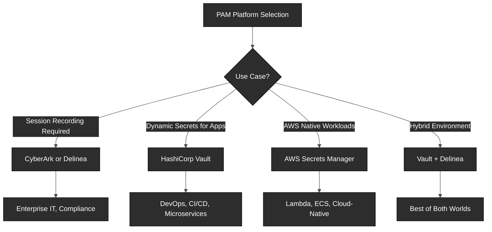

</div>

---

<div align="center">

<h3>Challenge 4: Dynamic Secrets at Scale</h3>

> *"How do you eliminate standing privileges for database access?"*

**My Answer:** Generate credentials on-demand with automatic expiration.

| Component | Description |
|:----------|:------------|
| **Database Secrets Engine** | PostgreSQL, MySQL, MSSQL support |
| **Lease Management** | Credentials expire automatically |
| **Role-Based Access** | Different TTLs for different roles |
| **Audit Trail** | Every credential generation logged |
| **Result** | No standing privileges, no credential sprawl |

**Solution Architecture:**

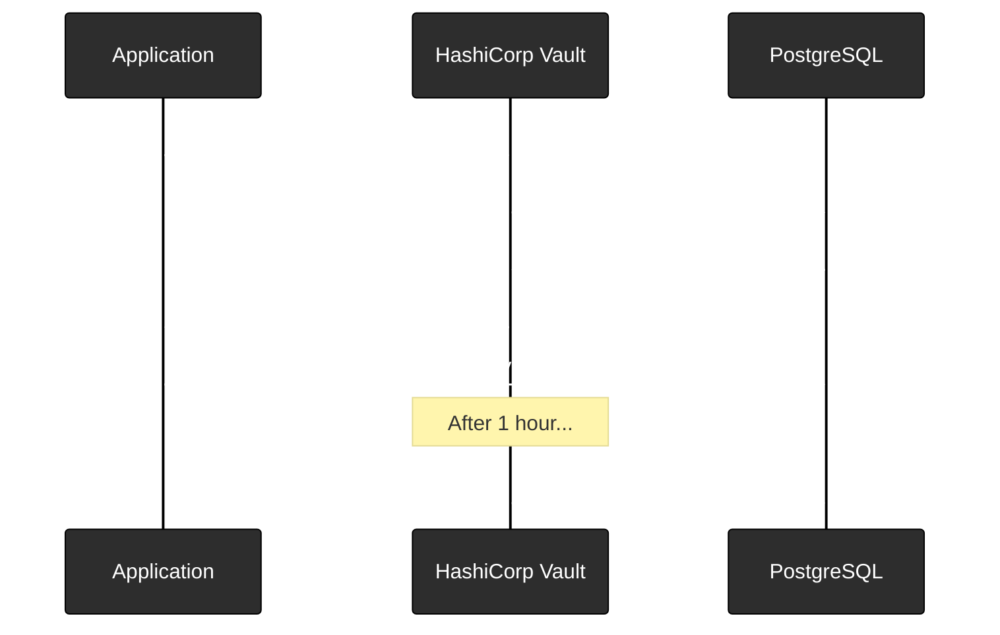

| Metric | Impact |
|:------:|:------:|
| Standing privileges | **Eliminated** |
| Credential rotation | **Automatic** |
| Audit coverage | **100%** |

</div>

---

<div align="center">

<h3>Challenge 5: Automated Password Rotation</h3>

> *"How do you rotate 1000 service account passwords without downtime?"*

**My Answer:** Coordinated rotation with verification and rollback.

| Component | Description |
|:----------|:------------|
| **Rotation Policies** | Configurable schedules per secret type |
| **Pre-Rotation Hooks** | Verify connectivity before rotation |
| **Post-Rotation Verification** | Test new credentials before committing |
| **Rollback Support** | Automatic rollback on verification failure |
| **Result** | Zero-downtime rotation at scale |

**Solution Architecture:**

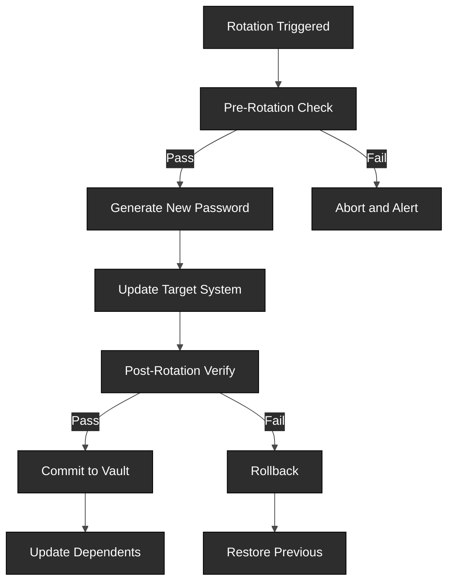

</div>

---

<div align="center">

### Architecture Decisions Summary

| Problem | My Solution | Why It Works |
|:-------:|:-----------:|:------------:|
| Multi-vendor management | Unified abstraction layer | Single API, multiple platforms |
| Cross-platform migration | Dry-run with field mapping | Zero-risk, auditable |
| Platform selection | Feature comparison matrix | Match strengths to use cases |
| Standing privileges | Dynamic secrets engine | On-demand with auto-expiration |
| Password rotation | Coordinated with verification | Zero-downtime at scale |

</div>

---

<div align="center">

## Key Features

### Core Capabilities

| Feature | Description |
|:-------:|:-----------:|
| **Delinea Python Client** | Full OAuth2 authentication, CRUD operations, folder management |
| **Unified PAM Client** | Single interface for Vault, Delinea, and AWS |
| **Migration Tools** | Bi-directional with dry-run, field mapping, JSON reports |
| **Award-Winning Dashboard** | Modern glassmorphism UI with real-time metrics |
| **Rich CLI** | Professional terminal UI with progress bars |
| **8 Lab Exercises** | Hands-on learning from basics to advanced |

### Platform Support

| Platform | Features |
|:--------:|:---------|
| **HashiCorp Vault** | KV v2, dynamic database credentials, PKI, transit encryption |
| **Delinea Secret Server** | OAuth2, secret templates, folder hierarchy, search |
| **AWS Secrets Manager** | Boto3 integration, rotation, cross-account access |

</div>

---

<div align="center">

## Architecture

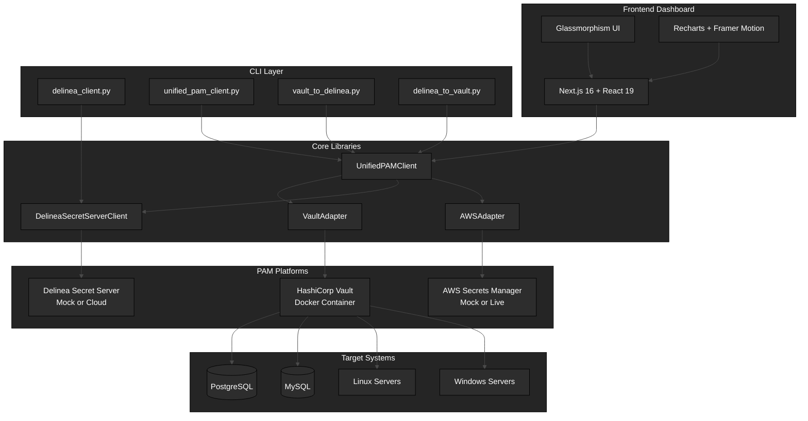

### Migration Flow

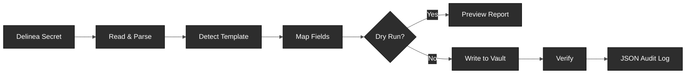

</div>

---

<div align="center">

## CLI Reference

### Delinea Client

| Command | Description |
|:--------|:------------|
| `--mock status` | Check connection and secret count |
| `--mock list` | List all secrets |
| `--mock get <id>` | Retrieve secret by ID |
| `--mock create` | Create new secret |
| `--mock folders` | List folder hierarchy |
| `--mock templates` | List available templates |
| `--mock demo` | Run full demonstration |

### Unified PAM Client

| Command | Description |
|:--------|:------------|
| `detect` | Discover available platforms |
| `health` | Health check all platforms |
| `get <id> --platform` | Get secret from specific platform |
| `compare` | Compare secrets across platforms |
| `demo` | Run cross-platform demonstration |

### Migration Tools

| Command | Description |
|:--------|:------------|
| `migrate <id> --dry-run` | Preview single secret migration |
| `folder <id> --base-path` | Migrate entire folder |
| `--output report.json` | Generate JSON audit report |
| `demo` | Run migration demonstration |

</div>

---

<div align="center">

## Lab Exercises

| Lab | Topic | Duration | Level |
|:---:|:-----:|:--------:|:-----:|
| 01 | Vault Fundamentals | 30 min | Beginner |
| 02 | KV Secrets Engine | 30 min | Beginner |
| 03 | Dynamic Database Credentials | 45 min | Intermediate |
| 04 | Automated Password Rotation | 45 min | Intermediate |
| 05 | Audit and Compliance | 30 min | Intermediate |
| 06 | Delinea Secret Server Basics | 30 min | Beginner |
| 07 | Cross-Platform Migration | 45 min | Advanced |
| 08 | Unified PAM Operations | 30 min | Advanced |

</div>

---

<div align="center">

## Platform Comparison

| Feature | CyberArk | Delinea | Vault | AWS SM |
|:--------|:--------:|:-------:|:-----:|:------:|
| Password Vaulting | 5/5 | 4/5 | 4/5 | 3/5 |
| Session Recording | 5/5 | 3/5 | 1/5 | 1/5 |
| Account Discovery | 5/5 | 4/5 | 2/5 | 1/5 |
| Dynamic Secrets | 3/5 | 2/5 | 5/5 | 2/5 |
| API Automation | 5/5 | 3/5 | 5/5 | 5/5 |
| Cloud Deployment | 3/5 | 4/5 | 5/5 | 5/5 |
| Open Source | No | No | Yes | No |
| Cost | $$$$$ | $$$ | $ | $$ |

### My Recommendations

| Scenario | Platform | Reason |
|:---------|:--------:|:-------|
| Large enterprise, strict compliance | CyberArk | Most comprehensive, industry standard |
| Mid-market, faster deployment | Delinea | Good balance of features and complexity |
| DevOps, cloud-native | HashiCorp Vault | Dynamic secrets, API-first design |
| AWS-native workloads | AWS Secrets Manager | Native integration, no additional tools |
| Hybrid architecture | Vault + Delinea | Best of both worlds |

</div>

---

<h2 align="center">Quick Start</h2>

<h3 align="center">Prerequisites</h3>

<p align="center">Python 3.10+ | Node.js 20+ | Docker & Docker Compose | 8GB RAM</p>

### Installation

```bash
# Clone repository
git clone https://github.com/MikeDominic92/Pam-MultiVendor-Lab.git
cd Pam-MultiVendor-Lab

# Set up Python environment
python -m venv venv
source venv/bin/activate  # Windows: venv\Scripts\activate
pip install -r scripts/requirements.txt

# Configure environment
cp .env.example .env

# Start Vault (Docker)
cd vault
docker-compose up -d
./scripts/init-vault.sh
```

### Run Frontend Dashboard

```bash
# Navigate to frontend
cd frontend

# Install dependencies
npm install

# Start development server
npm run dev

# Visit http://localhost:3000
```

### Run CLI Demos (No Credentials Required)

```bash
# Delinea client demo
python scripts/delinea_client.py --mock demo

# Unified PAM client demo
python scripts/unified_pam_client.py demo

# Migration demo
python scripts/delinea_to_vault.py demo
```

---

<h2 align="center">Project Structure</h2>

```
Pam-MultiVendor-Lab/
|-- frontend/                      # Next.js 16 Dashboard
|   |-- src/
|   |   |-- app/                   # App router pages
|   |   |   |-- page.tsx           # Security Dashboard
|   |   |   |-- secrets/           # Secrets Browser
|   |   |   |-- credentials/       # Dynamic Credentials
|   |   |   |-- pki/               # PKI Authority
|   |   |   |-- audit/             # Audit & Policies
|   |   |   `-- globals.css        # Design system
|   |   |-- components/
|   |   |   |-- layout/            # VaultShell, Sidebar, Header
|   |   |   |-- dashboard/         # VaultDoor visualization
|   |   |   |-- ui/                # GlassButton, NeonBadge, Toast, etc.
|   |   |   `-- providers/         # ClientProviders (Toast)
|   |   `-- lib/
|   |       |-- utils.ts           # Utility functions
|   |       `-- hooks/             # useReducedMotion, etc.
|-- scripts/
|   |-- delinea_client.py          # Delinea Secret Server Python client
|   |-- unified_pam_client.py      # Cross-platform PAM abstraction
|   |-- vault_client.py            # HashiCorp Vault operations
|   |-- vault_to_delinea.py        # Migration: Vault -> Delinea
|   |-- delinea_to_vault.py        # Migration: Delinea -> Vault
|   |-- config.py                  # Unified configuration
|   `-- aws/                       # AWS Secrets Manager integration
|-- vault/
|   |-- config/                    # Vault configuration files
|   |-- policies/                  # ACL policies
|   `-- scripts/                   # Initialization scripts
|-- delinea/
|   |-- api-examples/              # Python API examples
|   |-- powershell/                # PowerShell scripts
|   `-- templates/                 # Secret template definitions
|-- labs/                          # 8 hands-on exercises
|-- docs/                          # Documentation
|-- assets/                        # Screenshots and diagrams
`-- monitoring/                    # Prometheus & Grafana
```

---

<div align="center">

## Certifications Aligned

This lab supports preparation for:

| Certification | Alignment |
|:-------------:|:----------|
| **CyberArk PAM-DEF** | Vault concepts map to CyberArk components |
| **Delinea Security Academy** | Direct Delinea Secret Server experience |
| **HashiCorp Vault Associate** | Full Vault operations coverage |
| **HashiCorp Vault Operations Professional** | Advanced patterns and automation |
| **AWS Security Specialty** | Secrets Manager integration |

</div>

---

<div align="center">

## Roadmap

### Completed

| Version | Features |
|:-------:|:---------|
| v1.0 | Core Vault lab with databases and monitoring |
| v1.1 | AWS Secrets Manager integration |
| v2.0 | Delinea integration, unified client, migration tools |
| v2.5 | Award-winning glassmorphism dashboard with Next.js 16 |

### Upcoming

| Version | Features |
|:-------:|:---------|
| v2.6 | Azure Key Vault integration |
| v2.7 | Google Cloud Secret Manager |
| v3.0 | HashiCorp Boundary for session management |

</div>

---

<div align="center">

## Built With

<p align="center">
  
  
  
  
  
</p>

<p align="center">
  
  
  
</p>

| Category | Technologies |
|:--------:|:-------------|
| **PAM Platforms** | HashiCorp Vault 1.15+, Delinea Secret Server, AWS Secrets Manager |
| **Frontend** | Next.js 16, React 19, TailwindCSS v4, Framer Motion v12, Recharts |
| **Languages** | Python 3.10+, TypeScript, PowerShell, Bash |
| **Libraries** | hvac, python-tss-sdk, boto3, click, rich, pydantic |
| **Infrastructure** | Docker Compose, Prometheus, Grafana |
| **Databases** | PostgreSQL, MySQL (for dynamic secrets) |

</div>

---

<div align="center">

## Author

**Dominic M. Hoang**

GitHub: [@MikeDominic92](https://github.com/MikeDominic92)

</div>

---

<div align="center">

## Related Projects

| Project | Description |
|:-------:|:-----------:|
| [VendorAuditAI](https://github.com/MikeDominic92/VendorAuditAI) | AI-powered third-party risk management platform |
| [ai-access-sentinel](https://github.com/MikeDominic92/ai-access-sentinel) | ITDR platform with ML-powered anomaly detection |
| [entra-id-governance](https://github.com/MikeDominic92/entra-id-governance) | Microsoft Entra ID governance toolkit |
| [keyless-kingdom](https://github.com/MikeDominic92/keyless-kingdom) | Multi-cloud workload identity federation |
| [okta-sso-hub](https://github.com/MikeDominic92/okta-sso-hub) | Enterprise SSO with SAML, OIDC, SCIM |

</div>

---

<p align="center">
  <strong>PAM Multi-Vendor Lab</strong>
  <br/>
  <sub>Enterprise PAM expertise across CyberArk, Delinea, Thycotic, and HashiCorp ecosystems.</sub>
  <br/>
  <sub>Featuring an award-winning cybersecurity dashboard with dark glassmorphism design.</sub>
  <br/><br/>
  <a href="https://github.com/MikeDominic92/Pam-MultiVendor-Lab">GitHub</a>
  <br/><br/>
  MIT License - Copyright 2026 Dominic M. Hoang
</p>
