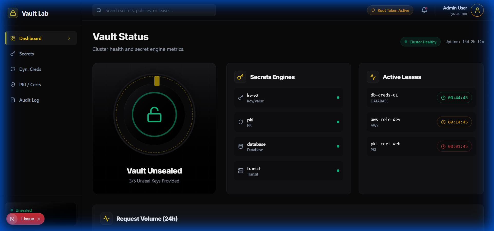
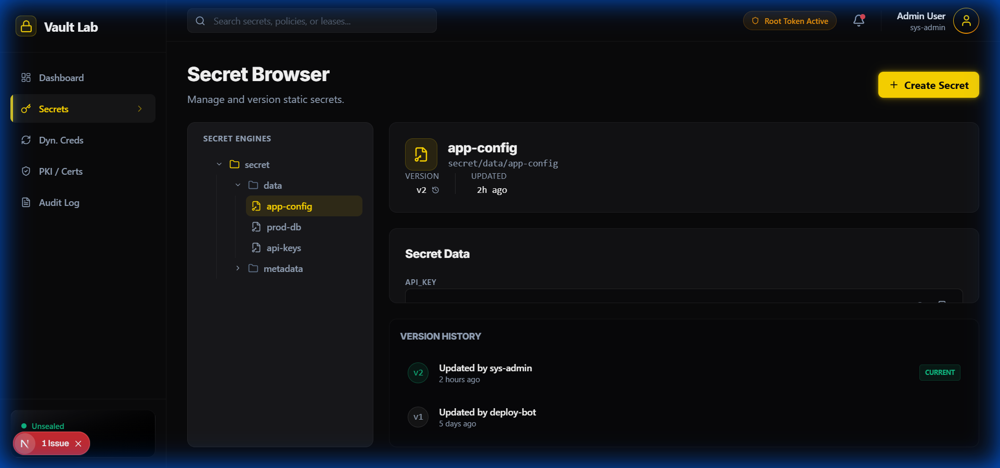
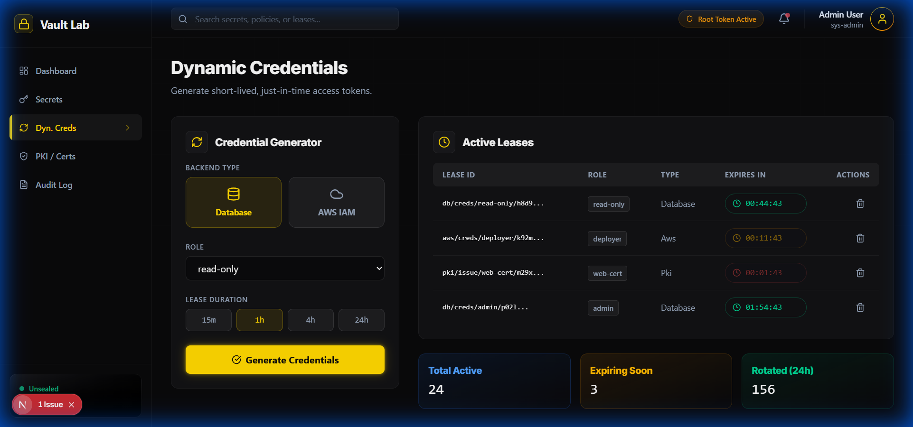
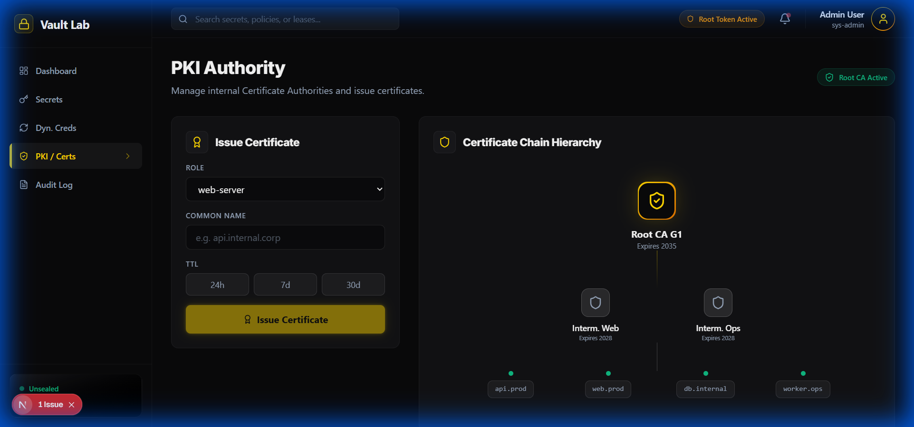
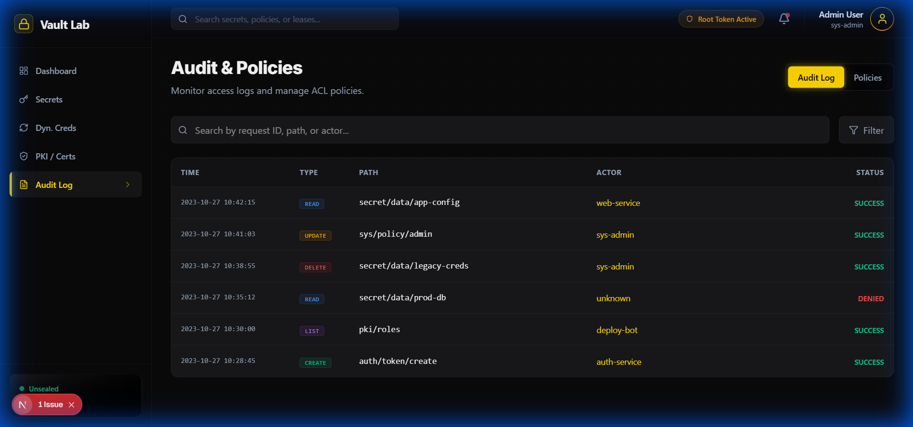

# PAM-Vault-Lab - Frontend Walkthrough

A specialized dashboard for HashiCorp Vault integration, designed for Privileged Access Management (PAM) with a Vault Stealth aesthetic featuring Obsidian Black backgrounds and Vault Gold accents.

## Technology Stack

- **Framework**: Next.js 16 with App Router
- **Styling**: Tailwind CSS v4 with custom Vault Stealth theme
- **Animations**: Framer Motion for vault door and transitions
- **Charts**: Recharts for request volume visualization
- **Icons**: Lucide React
- **Fonts**: Inter (headlines/body) + Fira Code (secrets/code)

## Design System

### Color Palette
| Color | Hex | Usage |
|-------|-----|-------|
| Obsidian Black | #09090B | Primary background |
| Vault Surface | #18181B | Elevated panels |
| Vault Gold | #FFD700 | Primary accent, vault icons |
| Amber Highlight | #F59E0B | Secondary accent |
| Slate Gray | #94A3B8 | Secondary text |
| Ghost White | #FAFAFA | Primary text |
| Emerald | #10B981 | Success states |
| Ruby Red | #EF4444 | Danger/revoked |
| Steel Blue | #3B82F6 | Info/links |

### Visual Effects
- Vault door opening animation on authentication
- Golden glow on active secrets and selected items
- Lock icon transitions between locked/unlocked states
- Countdown timers with pulse effect on expiring leases
- Glassmorphism panels with subtle gold borders

## Screens

### 1. Vault Dashboard
Central command center visualizing vault status and health.
- **Vault Door Animation**: Interactive visualization of unseal status
- **Active Leases**: Real-time tracking of credential TTLs
- **Request Volume**: 24-hour chart of API requests
- **Secret Engine Status**: KV, PKI, Transit, Database health cards



### 2. Secret Browser
Hierarchical management of static secrets with version control.
- **Tree Navigator**: Browse secret engines and paths
- **Version History**: Track secret changes over time with diff view
- **Masked Values**: Securely view and copy credentials
- **Metadata Display**: Created, updated, and version information



### 3. Dynamic Credentials
Just-in-time access management for database and cloud credentials.
- **Credential Generator**: Create short-lived database and cloud tokens
- **Lease Management**: View and revoke active leases
- **Role Selection**: Granular access control based on defined roles
- **TTL Countdown**: Visual timers showing credential expiration



### 4. PKI Certificate Authority
Internal certificate authority management and issuance.
- **Issuance Wizard**: Generate certificates for services
- **Chain Visualizer**: Interactive view of the trust hierarchy
- **Expiration Tracking**: Monitor certificate lifecycle
- **CRL/OCSP Status**: Certificate revocation indicators



### 5. Audit & Policies
Security monitoring and access control governance.
- **Audit Log**: Real-time stream of access events
- **Policy Editor**: HCL syntax highlighting for ACL management
- **Capability Badges**: Visual indicators of permissions (create, read, update, delete, list)
- **Token Management**: Active tokens and accessor information



## Custom Components

### Vault UI Components
- **VaultCard**: Glass panels with gold accent borders
- **SecretField**: Masked input with reveal button and auto-clear
- **LeaseTimer**: Countdown with color transitions (green to amber to red)
- **PolicyBadge**: ACL capability indicators
- **AuditEntry**: Formatted log entries with operation icons

## Running the Frontend

```bash
cd frontend
npm install
npm run dev
```

Visit http://localhost:3000

## Build

```bash
npm run build
```

## Key Technical Features

- **Tailwind v4**: CSS-first configuration with custom vault glow utilities
- **Framer Motion**: Complex animations for vault door and state transitions
- **Real-time Updates**: Smooth fade animations for live lease data
- **Responsive Design**: Adapts to all screen sizes
- **HCL Syntax Highlighting**: Policy editor with Vault-specific highlighting

## Next Steps

- Integrate with live Vault API for real secret operations
- Add WebSocket support for real-time audit log streaming
- Implement certificate issuance wizard with CSR generation
- Add policy simulation testing interface
